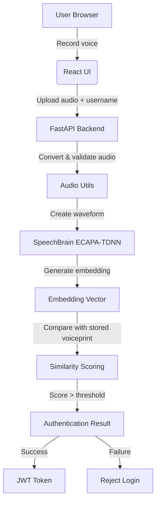
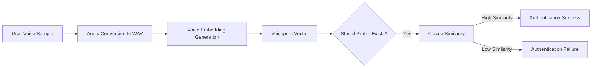

# VoiceKey Presentation Guide

## Purpose
This file is a teacher-friendly explanation of the VoiceKey project, designed to help you present the system clearly during viva or classroom demonstrations.

## Project Overview
**VoiceKey** is a voice biometric authentication system that lets a user register and log in using voice instead of a password. The frontend is implemented in React, and the backend is implemented in FastAPI with a Python-based speaker recognition model.

## Core Idea
- The user records a short voice sample in the browser.
- The backend converts the audio to WAV and checks that it is live speech.
- A neural speaker recognition model generates a voice embedding.
- The system compares the login embedding with a stored voiceprint using cosine similarity.
- If the similarity is high enough, the user is authenticated and receives a JWT token.

## How the Model Works
1. **Capture audio:** The browser records the voice phrase and sends it to the backend.
2. **Convert audio:** The backend converts the incoming audio into WAV bytes and verifies that the recording is valid.
3. **Extract embedding:** The SpeechBrain ECAPA-TDNN model converts the audio waveform into a numerical vector representing the voice.
4. **Compare embeddings:** The backend compares the new voice vector to the stored user voiceprint using cosine similarity.

If the similarity score exceeds the threshold, the system accepts the login.

## Why Use a Liveness Challenge
The liveness challenge helps prevent replay attacks and fake recordings.

- The backend generates a random phrase or code.
- The user must speak that phrase immediately.
- The system validates the phrase and rejects stale or recorded audio.

## Technology Stack
- Frontend: React + Vite
- Backend: FastAPI + Python
- Speaker model: SpeechBrain ECAPA-TDNN
- Database: SQLAlchemy with SQLite/PostgreSQL support
- Authentication: JWT tokens

## System Components
- `React UI` - records audio, shows liveness phrase, and sends data to the backend.
- `FastAPI backend` - handles registration, login, and admin endpoints.
- `Audio Utils` - converts and validates browser audio.
- `ML Engine` - loads the speaker model and generates embeddings.
- `Database` - stores user information and voice embeddings.

## Presentation Diagrams

### System Workflow

### Model and Voice Verification Flow

## Teacher / Viva Talking Points
- **Explain the problem:** Passwords are insecure and hard to manage, while voice biometrics provide a more convenient second factor.
- **State the main goal:** To build a voice login system that uses a neural speaker recognition model and liveness challenge.
- **Describe the security design:** Dynamic challenge phrases, JWT, rate limiting, and no raw audio storage.
- **Clarify the model role:** The model converts voice into a numerical representation that can be compared reliably.
- **Highlight the architecture:** Frontend, backend, ML engine, and database are separate layers.

## Recommended Answers
- **Why voice biometric?** Voice is a natural identifier, widely available on devices, and harder to steal than passwords.
- **How does liveness work?** The system asks the user to speak a randomly generated phrase, ensuring the audio is captured live.
- **What is cosine similarity?** A measurement of how close two vectors are in direction. Higher values mean the voices are more similar.
- **What does SpeechBrain do?** It provides a pre-trained speaker recognition model to generate voice embeddings.
- **How is user data protected?** Only voice embeddings are stored, not raw audio, and JWT tokens are used for session authentication.

## Notes for Presentation
- Keep diagrams visible when explaining the architecture.
- Practice a 1-minute summary: problem, solution, technologies, and security.
- Use terms like "voiceprint", "embedding", "liveness", and "cosine similarity".
- If asked about limitations, mention noise sensitivity and the need for stronger spoof detection.

## File References
- `backend/main.py`
- `backend/routers/auth.py`
- `backend/services/auth_service.py`
- `backend/ml_engine.py`
- `src/pages/Register.jsx`
- `src/pages/Login.jsx`
- `src/hooks/useVoiceRecorder.js`
